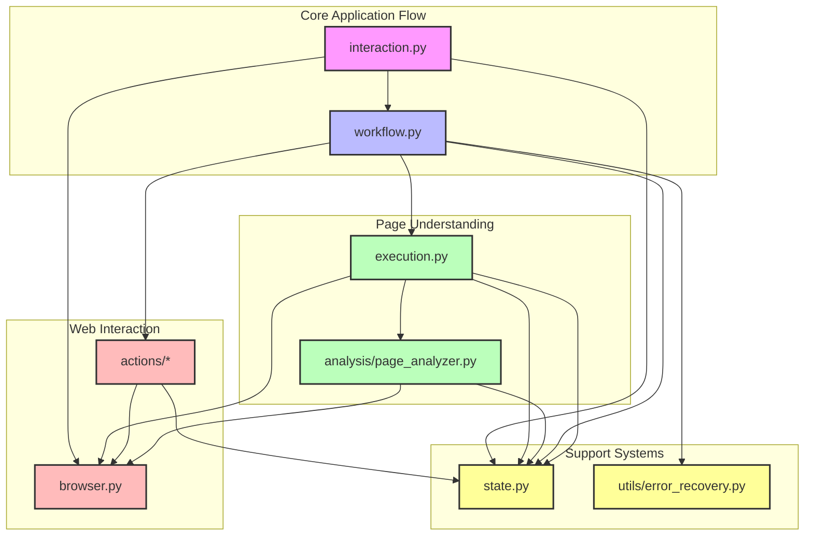

# Module Architecture

## Module Responsibilities

### Core Application Flow
- **interaction.py**: Application entry point, user I/O, lifecycle management
- **workflow.py**: Workflow engine, task orchestration, parallel execution

### Page Understanding
- **execution.py**: Page analysis, action preparation, interaction prediction
- **analysis/page_analyzer.py**: Structured page analysis, accessibility evaluation

### Web Interaction
- **actions/**: Concrete web interaction implementations
- **browser.py**: Browser automation and control

### Support Systems
- **state.py**: Application state management, task tracking
- **utils/error_recovery.py**: LLM-based error recovery and adaptation

## Key Design Principles

1. **Separation of Concerns**
   - Clear module boundaries with focused responsibilities
   - Minimal circular dependencies
   - Hierarchical organization

2. **Extensibility**
   - Modular action system
   - Pluggable analysis components
   - Flexible workflow engine

3. **Robustness**
   - Comprehensive error handling
   - State isolation per interaction
   - Graceful degradation

4. **Accessibility Focus**
   - Rich page analysis
   - Semantic understanding
   - Adaptive interaction

5. **Learning & Adaptation**
   - Pattern recognition
   - Error recovery
   - Predictive interaction
